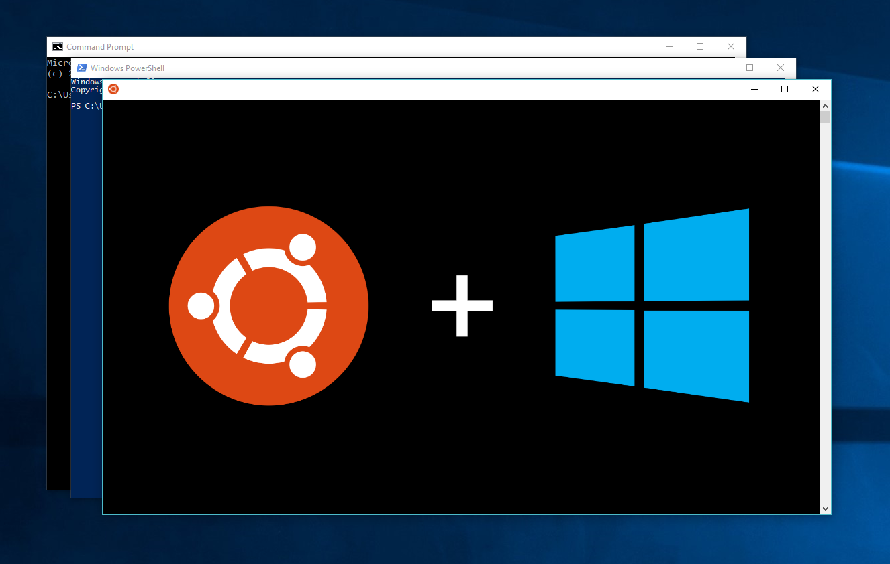
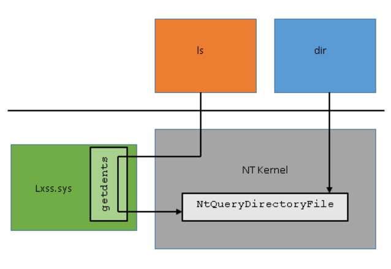
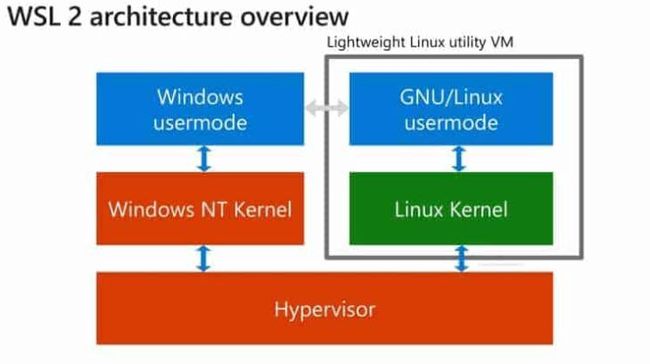
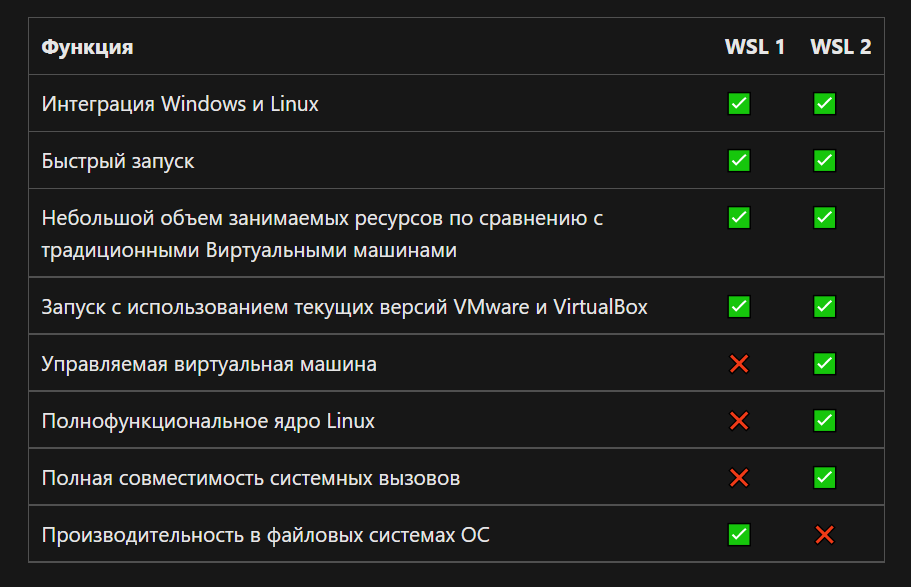
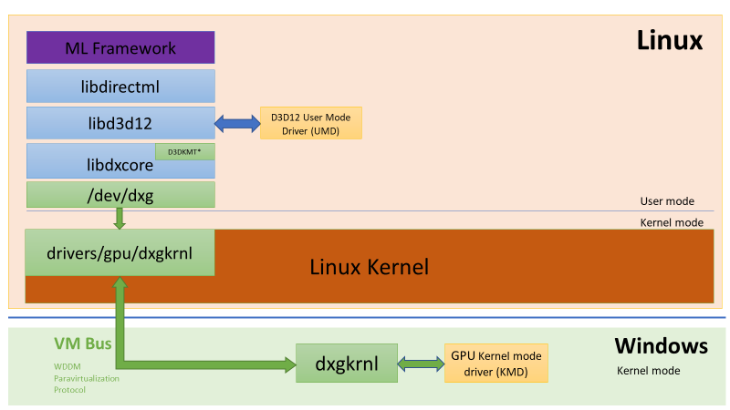
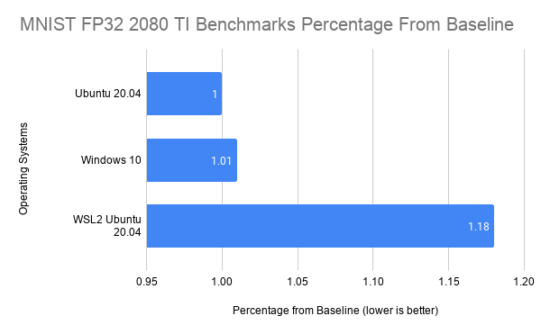

# WSL



30 марта (а у некоторых это 1 апреля было)) 2016 года Microsoft анонсировала модуль Windows Subsystem Linux (подсистему Linux) или просто WSL. Система, что должна была позволить запускать исполняемые Linux файлы\бинарники нативно прямо в системе Windows. Тогда это приняли за шутку, но по факту это оказалось правдой. Нынче WSL активно развивается более 5 лет, часть людей действительно благодаря ей отказались от хранения 2 операционных систем на одной машине. В 2019 году была выпущена вторая версия системы, правда без пары ключевых элементов. В будущем же нас ждёт ещё множество новых обещанных фич и в принципе перестройка архитектур операционных систем... 

Ну а пока, давайте разбираться, как же WSL работает и самое главное, для каких целей.

## Для чего?

Первым, и в последствии последним моментом будет рефлексия - а зачем же это нужно нам? И лучший ответ на вопрос - потыкать этот вопрос. Потому сразу в бой!

## Установка WSL

### Ставим саму подсистему

Голая теория не всегда интересно (почти никогда), поэтому перед этим давайте сразу установим на пробу какой нить дистрибутив, тем более устанавливается она довольно долго (учитывая загрузки) и можно за это время и почитать теории, или посмотреть чего. Короче одни ~~периоды распития кофе с печеньками~~ ожидания, уже который год...

О чём это я.

    Для начала запустите Power Shell или cmd, кому что по вкусу, с правами администратора и выполните:

   ``dism.exe /online /enable-feature /featurename:Microsoft-Windows-Subsystem-Linux /all /norestart``

   ``dism.exe /online /enable-feature /featurename:VirtualMachinePlatform /all /norestart``

    Есть ещё вариант для любителей GUI - через меню пуск ищете меню настроек "компоненты" -> другие компоненты Windows и там включаете 2 пункта
    - Подсистема Windows для Linux
    - Платформа виртуальной машины (для включения Hyper-V)

    Внимание!!!, вторая команда , так же как и вторая настройка устанавливает модуль Виртуальной Машины, необходимой для работы WSL 2, да и в принципе в некотором смысле превращает некоторые части Windows в части виртуальной машины. 
    В любом случае при этом происходит активация HyperV, которая забирает на себя виртуализацию процессора (VT-x и т.д.), а значит такие программы, как VirtualBox не смогут её использовать и им придётся использовать HyperV, если они способны на это. Как минимум, заранее проверьте настройки таких программ, если помните, что там были галочки с нативной виртуализацией.
    Если кратко про последствия - никакой аппаратной виртуализации в программах, не умеющих работать параллельно с Hyper-V. Учтите это, и если не хотите терять быстроту работы других программ с виртуализацией, пропустите части про WSL2, включая 2 команду (именно вторую команду, так как именно она включает Hyper-V).
    
Далее желательно сходить в перезагрузку системы, хотя можно и так.

Так, теперь есть 2 пути. В любом из них будьте аккуратнее, так как при установке скачивается полноценный Linux, который **может весить до 1 Гб**. В данном случае советую так же проверить свободное место на диске.
    
- Первый путь - Появившийся недавно для ленивых (в последних версиях системы) `wsl --install`. В данном случае WSL будет установлена вместе со стандартной Ubuntu последней версии со стандартными настройками. Так сказать вариант, когда не требуется ничего специфического и хочется "раз, и готово!". 

- Второй путь - Установить вручную, как true Линуксойды) Второй способ как раз описан ниже и остался от старых версий. 

После перезагрузки требуется установить ещё специальный модуль-дополнение, который обновит WSL до 2.0 (если вы включили виртуализацию).
Для этого переходим [сюда](https://docs.microsoft.com/ru-ru/windows/wsl/wsl2-kernel) и скачиваем установщик, а там далее-далее-готово.

### Установка самой Linux на WSL
Есть 4 варианта. К слову сказать, эти же методы можно использовать и для доустановки других версий Linux (дистрибутивов). Однако, если какой то дистрибутив уже установлен у вас в системе, *то установить ещё один такой же можно только 4 способом*. 

- Простой - установить дистрибутив из магазина. Заходим в Windows Store, находим там Ubuntu или Kali или что вам больше по душе (возможно что-то платное), далее получить->установить. Теперь можете пробовать команду wsl или ubuntu прямо в консоли.

- Второй вариант - если хотите воспользоваться всем пафосом написания кодов в консоли, то в новых версиях Windows можно использовать `wsl --install -d [Имя дистрибутива]`. Для печати списка доступных дистрибутивов можете написать `wsl --list --online`

- Третий вариант - установить дистрибутив напрямую через скачивание пакета и установку в систему. Скачать желаемый дистрибутив напрямую можно [тут](https://docs.microsoft.com/ru-ru/windows/wsl/install-manual#downloading-distributions). Далее либо запускаете пакет установки, либо выполняете команду в Power Shell `Add-AppxPackage ...path...\app_name.appx`, либо на крайний случай вручную запускаете установщик пакета.
Кстати, для **создания таких дистрибутивов** вручную, если сильно хочется, есть специальный инструментарий, можете начать [тут](https://github.com/MicrosoftDocs/wsl/blob/master/WSL/enterprise.md#creating-a-custom-wsl-image)

- **Четвёртый вариант (отличается от остальных)** сделан для ручной установки и упаковки дистрибутива, как образы контейнеров в аналогах докера или виртуальных машин. Данный вариант подходит не только и не сколько для установки образов, сколько для возможности их упаковки и переноса на другие машины или доустановки ещё одной такой же версии Linux (а почему бы и нет, 2 Linux всё равно лучше одного))

    Для упаковки уже созданного контейнера требуется выполнить `wsl --export <Название версии Linux> <Куда сохранять>`. Главный момент - при запаковке вы получите архив вместе со всеми вашими файлами внутри, то есть это действительно готовый контейнер

    Для распаковки выполняем команду  `wsl --import <name> <where_safe> <path_to_file>` . `name` - как назвать дистрибутив, которым вы будете пользоваться. `where_safe` - место, где будет храниться служебные и основные (типа home и т.д.) файлы дистрибутива. Ну то есть виртуальный жёсткий диск и т.д. . `path_to_file` - путь к файлу с архивом дистрибутива

Теперь, пока выбранный вами дистрибутив скачивается и устанавливается, окунёмся чуть в теорию, чтобы ~~поспать~~ убить время.

## Щепотка теории

### Зачем

Как уже было сказано, Microsoft [анонсировала](https://blogs.windows.com/windowsdeveloper/2016/03/30/run-bash-on-ubuntu-on-windows/) 1 апреля (а по факту 30 марта, но никто этого не заметил) систему WSL. В подробностях говорилось, что данная система естественно вышла из попыток реализовать такие же удобные и нативные консольные интерфейсы, какими обладают Unix системы. В тоже время команда WSL строго предупреждала, что система является тестовой и не факт, что будет работать во всех желаемых сценариях. Во вторых, и как по мне это самое главное, WSL является лишь инструментом разработчика, а не полноценной возможностью создать и держать пару Linux на вашем Windows сервере. И в третьих, не стоит забывать, что Windows, это Windows, а Linux, это Linux, и полноценно взаимодействовать между собой приложения (по крайне мере пока) всё равно не смогут. В случае WSL 2 это даже усугубилось.

В любом случае, официально всё было сделано для нас, любимых ~~пользователей~~ программистов, чтобы мы смогли полноценно работать в Windows. К сожалению статистики использования системы я не нашёл, но если судить по множеству разных статей и отзывам некоторых людей как на видео, так и в тексте, система набирает обороты и люди действительно ею пользуются.

### Внутря

Так вот, что же внутри неё такого, чего нет к примеру в том же cygwin (он же git-bash и т.д.). Между версиями, которая появилась в 2016 году и WSL 2 есть одно существенное отличие - первая по факту является транслятором (превращает одни команды в другие), вторая является пара-виртуальной машиной (то есть такой машиной, система которой заранее знает, что она виртуальная и имеет ряд модификаций для работы в виртуальной среде, типа вместо обращений к биос - обращения к HyperV)

WSL:



По своей сути WSL - это пользовательский интерфейс (UI, или ещё проще окошко для общения с человеком) плюс 2 драйвера в своей основе: LXss.sys и LXCore.sys. По факту в ядре Windows есть особая семантика (режим работы), которая позволяет преобразовывать системные вызовы перед исполнением (ядро NT, что с него взять...). За счёт это и работает WSL, то есть когда происходит syscall (вызов функций ядра Windows или Linux), WSL дополняет данный вызов командой-меткой, что его должен обработать LXss.sys, который превращает (транслирует) вызовы из ядра Linux в ядро Windows. Для некоторых вызовов достаточно только перекопировать данные в другие регистры ядра, для других приходится делать множество операций. [Здесь](https://docs.microsoft.com/ru-ru/archive/blogs/wsl/wsl-system-calls) про это расписано подробнее.

Отдельно стоит упомянуть файловую систему WSL, которая по факту существует прямо на диске, то есть к файлам дистрибутива можно "сходить" и посмотреть на них из Windows. Хотя гораздо безопаснее это делать через механизм сетевого доступа, чтобы не испортить эти самые файлы.

Для работы Linux части используется виртуальная файловая система VFS, которая является родной для Linux системы. Однако, файлы и даже типы их существования (к примеру директория - тоже файл для Linux, да и в целом там всё есть файл, даже устройство вашего компьютера... тьфу) не очень совместимы с Windows и для этого были созданы 3 файловые системы, работающие из-под VFS и имитирующие устройства и другие необходимые компоненты (к примеру содержимое /dev). Не буду вдаваться в подробности, почитать можете [здесь](https://docs.microsoft.com/ru-ru/archive/blogs/wsl/wsl-file-system-support) и [здесь](https://docs.microsoft.com/en-gb/windows/wsl/file-permissions)

WSL 2:



Как уже говорилось - выкидываем транслятор и ставим пара-виртуальную машину. Сделано это было ради нескольких целей - во первых у нас теперь есть полноценное ядро Linux, и значит всякие баги, связанные с особенностями архитектуры уходят в прошлое (привет dbus), а ещё у нас изолированная файловая система, которая работает быстрее, потому что не общается с букой NTFS.

Как говорит Microsoft - главные четыре особенности, ради которых они сделали вторую версию, это:

1) Ускорение работы с файлами внутри Linux
2) Поддержка GPU
3) Поддержка систем виртуализации аля Docker
4) Поддержка GUI приложений

Вторая особенность стала доступна буквально недавно, в октябре 2021 года вместе с новым обновлением 21H2 (или 19044). Основная его магия - возможность использовать в wsl машинах GPU для вычислений и подобных задач. Можно подумать, что это означает использование и GUI (оконных) приложений. Но, к сожалению, Microsoft пожадничали, и 4 фишка в Windows 10 не доступна. Эксклюзив для Windows 11, так сказать.

Про работу файлов же стоит сказать отдельно, так как она в одно и тоже время стала и быстрее и медленнее. Медленнее в случае общения WSL с хостом между собой. Раньше ~~когда трава была синее~~ файлы все были буквально внутри файловой системы Windows (NTFS), приходилось лишь оперировать VFS, теперь же они находятся на виртуальном жёстком диске, и если с самой собой системе стало проще работать, то с Windows общение теперь происходит только через сетевой протокол, что сильно всё замедляет.

Так что имейте в виду, что если ван нужна "совместная" работа двух систем (и Windows и Linux) с файлами в одном расположении, то лучше воспользоваться WSL 1, нежели второй версией

Про Докеры же, мы поговорим отдельно

Пример сравнения двух версий:



## Как в это играть

### Команды wsl консоли

Что мы делаем первым делом после установки? Нет, не ставим cuda, а пишем `wsl --help`, чтобы просто посмотреть, что же мы можем по факту делать. И по тому самому факту, не много чего, хотя большего и не требуется, минимализм).

Первое, что видим, `--exec`, или `-e`, или просто `--`. Что это значит всё? Выполнение команды стандартной консоли Linux (в случае Ubuntu - bash) без запуска самой оболочки. Если вам хочется, она позволяет творить чудеса класса `dir | wsl grep txt`, то есть передаём на вход grep выход из Windows команды dir. Заметьте, система конвейера `|` не передаётся.

`wsl ls | grep txt` - итог 'grep' is not recognized. Для таких вещей очевидно делаем `wsl ls | wsl grep txt`. Пробуем!

Про `wsl --help` я думаю вы уже догадались. Про `--install ` так же

`wsl --set-version <dist> v` - изменить версию дистрибутива dist на v (с 1 на 2 или наоборот). Занимает некоторое время

`--shutdown` - убивает все машины hardReset'ом. Для WSL1 просто уничтожаются все процессы. А вот для WSL2 завершает работу виртуальной машины (по факту которой она и является) сразу и без ожидания. Докеры тоже погибают, однако не советую, докер может сломаться (и таки сломается).

Далее имеем группу команд `--export` `--import`. Import уже была описана выше как команда для установки дистрибутива из архива в определённое место. Export же позволяет упаковывать уже существующий у нас дистрибутив для развёртывания на другой машине. Важный!! момент, при упаковке сохраняется состояние дистрибутива целиком, то есть вместе с вашими файлами, пользователями и т.д.

Следующее `--list`, вывод установленных дистрибутивов простым (ну очень простым) списком. Ну то есть просто показывает, какие Linux у вас установлены. Можно добавить чуть информации в виде версии и состояния дистрибутива, написав `-v`, своеобразный аналог `ls -l` для list.

`--terminate -t` - по факту завершает все процессы, кроме init(родительский процесс, порождающий остальные), запущенные в указанном дистрибутиве. В случае с WSL 2 не завершает работу самой виртуальной машины. Она сама завершится по истечению таймера (настраивается в конфиг файле, по умолчанию 8 секунд).

`--set-default`- написано, установить по умолчанию. В принципе так и есть, выбрать дистрибутив для запуска по умолчанию по команде wsl или запуска bash команд.

`--set-default-version` - установка, какую версию по умолчанию ставить для новых дистрибутивов (1 или 2). Заметьте, по самому умолчанию дистрибутивы ставятся как первая версия машины.

Последний момент `--unregister` - удаление дистрибутива. Да, полностью, вместе со всеми файлами, так что аккуратнее!

## Базовые команды Bash

Теперь, после установки и перезагрузки системы мы можем попробовать поиграть со стандартной консолью bash.

Давайте теперь рассмотрим некоторые базовые команды bash, через которые можно взаимодействовать с системой. И начнём с самой простой `cd`

```bash
cd folder # Переход в другую рабочую папку
```

Выполняет просто действие - указать Shell, в какой директории мы теперь будем работать. Кстати можно заметить, что текущую директорию, где мы работает, можно увидеть в самой строке ожидании команды, или введя команду `pwd`

```bash
pwd #Текущая рабочая директория
```

Эта команда делает довольно простое действие - печатает полный путь к текущей директории от корня (что такое корень узнаем чуть позже, но в краце, это как в Windows кнопка диск C)

Следующей полезной командой будет `ls`

```bash
ls # Список файлов и папок в текущей директории
```

Позволяет просто посмотреть, какие файлы и папки содеражатся в текущей директории. И в этот момент мы можем глянуть на дополнительные ключи к командам.

Дело в том, что просто запускать команды хоть и полезно, но иногда хочется немного изменить их поведение. 

К примеру, в обычном исполнении `ls` выводит только список файлов, без какой либо информации что есть папка, а что есть файл, или их размера.

```bash
git2$ ls # список файлов
1.cpp  2.txt  a.out  git3  test_kakoito
```

Чтобы это подправить, и вывести дополнительную информацию, мы добавим ключ `-l`

```bash
ls -l # Подробный список файлов
total 20
-rw-r--r-- 1 user user    62 Sep 26  2022 1.cpp
-rw-r--r-- 1 user user     0 Sep 26  2022 2.txt
-rwxr-xr-x 1 user user 16696 Sep 26  2022 a.out
drwxr-xr-x 1 user user  4096 Sep 26  2022 git3
drwxr-xr-x 1 user user  4096 Sep 26  2022 test_kakoito
```

Смотрите, теперь информации стало в разы больше. Правда, пока она кажется не очень понятной нам. Но на неё внимательнее мы посмотрим немного позже.
Как понимаете, `ls` можно использовать не только для показа списка файлов в текущей директории, но и в любой другой. Нужно просто указать ей путь до папки, на которую мы хотим посмотреть. Причём этот путь может быть как относительный, так и абсолютный

```bash
git2$ ls git3
1.txt  2.txt
```

```bash
git2$ ls /home/user/git2/git3
1.txt  2.txt
```

И в этот момент давайте ещё познакомимся с такими элементами, как `.` и `..`

По факту, это ярлыки. `.` - ярлык в текущую директорию, в которой она находится. Это может показаться странным, потому то мы и так уже в ней работаем. Но это может потребоваться, когда нужно к примеру написать программу, которая будет работать с текущей директорией, но не знает где она находится, так как может оказаться на другом компьютере. Или просто проблема того, как указать, что нужно работать именно с тем местом, где мы находимся для программ, которые всегда требуют указывать место.

На самом деле даже когда вы просто вводите `ls`, он выполняет команду `ls .`

`..` - Это более интересный ярлык. Он указывает на директорию, находящуюся выше. То есть это этакий вариант кнопки 'назад'. К примеру, если написать `cd ..`, то вы окажитесь в родительской директории

```bash
git2$ ls
1.cpp  2.txt  a.out  git3
git2$ cd git3
git3$ cd ..
git2$
```

Аналогично, можно и с помощью `ls` посмотреть, что находится в директории выше уровнем

```bash
git3$ ls ..
1.cpp  2.txt  a.out  git3
```

Это ещё не всё. У `ls` есть ещё режим показа скрытых файлов `ls -a`, рекурсивный режим `ls -R`  и многое другое. Возникает вопрос, где искать все возможные команды. Ладно, не возникает, очевидно что в интернете, но вот если нет сети, а?

Да, правильно, на помощь приходит команда `man`. С помощью неё можно прочитать документацию про множество программ. Обычно, если вы устанавливаете какую то правильно и прямыми руками написанную программу, то с ней обязательно идёт документация, записываемая в man. Можете попробовать открыть документацию для ls

```bash
man ls # справка по команде ls
```

Выход из man на кнопку 'q'

Ещё небольшое пояснение за виды ярлыков для консоли. Есть ещё такой ярлык `~` - он означает вашу домашнюю директорию. Вы кстати обычно именно в неё попадаете, когда только включаете консоль.

## Работа с файлами

Теперь, когда мы умеем работать с навигацией по папкам, теперь хочется научиться и манипулировать ими. Начнём с самого просто - если ничего нет, то и манипулировать нечем, правильно? Так давайте созидать!

```bash
mkdir awesomeDir #создать директорию
```
Эта команда просто создаёт новую директорию в той, где вы сейчас работаете. Естественно, по аналогии с `ls` вы можете прописать и абсолютный путь для создания директории. И использовать `.` и `..`, чтобы создавать директории к примеру в папке родителя

Дальше, папки мы научились создавать. Теперь нужно к ним создать детей - файлы.

```bash
touch file #создать файл
```

Интересный момент, команда touch на самом деле была создана, чтобы отмечать файлы как недавно открытые (дотронуться до них). Но таким её функционалом никто не пользуется. Зато всем очень удобно использовать её побочный функционал - создавать файлы, если таких ещё нету.

Отлично, создавать объекты мы научились. Теперь давайте будем их уничтожать))

```bash
rm file
```

Таким образом, мы можем удалить файл 'file'. Внимание, в Linux нет никакой корзины, как в Windows. Поэтому, когда вы удаляете какой либо файл, он удаляется навсегда, так что будьте осторожны.

Кстати, `rm` поддерживает простые 'шаблоные' записи. А именно записи вида `rm *.txt`, что означает, что требуется удалить все файлы, заканчивающиеся на 'txt'

Для удаления директорий просто написать `rm dir` не получится, так как директория содержит файлы и он не даёт их стереть (вот такая не справедливость). Но есть выход - рекурсивный вызов

```bash
rm -r dir
```

В таком случае вы говорите `rm`, что хотите стереть не только этот файл или указатель на директорию, но и всё что внутри неё и внутри папок внутри неё и так далее

И так, создавать и удалять мы научились, теперь попробуем подвигать файлы

```bash
mv file newplace/newFileName
```

Думаю уже можно заметить, что сначала мы указываем кого хотим двигать, а потом куда. Обратите внимание, что при этом мы пишем `newFileName`. Это означает, что файл получит новое имя. Так же работает и простое переименовывание файла

```bash
mv oldName newName
```

И конечно, путь к новому месту (да и к самому файлу) можно писать как относительно, так и абсолютно

```bash
mv file /home/otherUser/file
```

С директориями работает всё точно так же, без каких либо отличий

```bash
mv dir newplace/fordir
```

Так, с этим тоже справились. Теперь переходим с самому интересному - копирование

```bash
cp file path/fileCopy
```

Как видим, всё просто. Однако, для директорий тут действует правило, аналогичное `rm`. А так же, cp тоже поддерживает простейшие шаблоны `*.c++`

```bash
cp -r dir newdir
cp *.cpp new/place/to/copy
```

Правда, когда вы используете шаблоны, нужно указывать путь не с новым именем файла, а только к папке, куда будете копировать.

Ещё один не мало важный момент в базовых принципах работы bash - конвейеры и потоки ввода/вывода.

Начнём с потоков. Смотрите, у каждой программы и команды bash есть три базовых пути взаимодействия с внешним миром операционной системы и остальных программ:
- через ключи и параметры при запуске, как `mv file newfile`, где file и newfile будут параметрами запуска
- поток ввода - когда программа ждёт ввода от пользователя с клавиатуры или что-то подобное. К примеру, когда вас просят ввести пароль после запуска программы или подобное.
- поток вывода - Та самая печать результата в консоль, к которой вы привыкли. Кстати, таких потоков вывода 2 - один для обычной печати и второй для печати ошибок, сейчас разберём.

Кроме этих способов конечно существует ещё и работа с файлами, или сетью, или внешними устройствами. Но мы сейчас остановимся именно на потоках.

Итак, на самом деле понятие потоков ввода и вывода - это работа программы со специальными мнимыми файлами, куда информация для неё заносится и куда сама программа эту информацию заносит. По стандарту эти файлы привязаны к эмулятору терминала, из которого программа запущена. Тем самым она может взаимодействовать привычным способом с консолью, как мы привыкли. Но эти файлы можно и изменить, причём прямо на лету

```bash
ls 1>ls.txt
```

Здесь написано, что первый поток, а именно поток вывода теперь должен работать с файлом *ls.txt*. При этом сам файл будет создан с 0 всегда, и даже если он уже существовал, вся информация из него будет стёрта. Этого можно избежать такой конструкцией

```bash
ls 1>>ls.txt
```

Что означает, что файл нужно до записать, а не создавать с 0. Можете попробовать и посмотреть, как это работает.

Как уже говорилось до этого, потока вывода существует 2: для печати и для ошибок. второй поток собственно и называется так

```bash
ls 2>error.txt
```

Ради эксперимента, можете попробовать прочитать директорию, из которой читать нельзя. К примеру */root*. На вывод ничего отправлено не будет, как раз результат только запишется в *error.txt*, так как произошла ошибка.

Поток ввода тоже можно привязать к другому файлу. Но перед этим давайте познакомимся с ещё одной командой - `cat`

```bash
cat file1 file2 ... fileN # Распечатать подряд содержимое file1 file2 и остальных файлов
```

Нет, `cat` не от слова кошка, хотя очень хочется так думать. `cat` это сокращение от слова 'concatenate', или соединять по русски. На самом деле программа cat была создана для того, чтобы печатать несколько файлов подряд. Но как обычно, об основном функционале многие забыли, и начали пользоваться этой функцией только с **целью печати файлов**

```bash
cat file
```

Так вот, если вы просто напишете cat без каких либо параметров, он будет работать как эхо того, что вы в него пишете. Попробуйте

```bash
cat
123
123
Бу
Бу
```

И в этот момент у вас может возникнуть ещё один важный вопрос - как ~~выйти из vima~~ закрыть эту штуку, если она всё отражает и никакие кнопки не работают. **Для закрытия каких либо программ принудительно есть сочетание клавиш - ctrl+c.** Да, такое же, как и для копирования в обычном мире. Именно по этому в терминале обычно копирование работает либо по правому клику мышки, либо через shift + ctrl + c. В общем нажимайте одновременно ctrl+c и будем вам спасение.

Так, вернёмся к нашим потокам. Мы уже обсудили потоки вывода, теперь про поток ввода. Давайте сохраним что-то в файл, а потом отдадим его на вход `cat`.

```bash
echo "12345" > 1.txt
cat < 1.txt
```

Да, правильно. Просто повернули стрелочку в другую сторону. Эта запись конечно почти аналогична просто `cat 1.txt`. Но всё же отличие в том, что в коде выше мы передаём файл не как параметр, а именно как новый поток для функции `cat`.

Кстати, мы воспользовались ещё одной новой командой - `echo`. Она довольно простая, но очень полезная команда, которая делает только одну вещь - отправляет всё, что ей подали как параметры, на поток вывода. То есть если `cat` отправляет всё, что получил на поток вЫвода всё то, то получил на поток ввода, то `echo` отправляет всё то, что получила как параметры на поток вЫвода. Со временем, когда будете изучать новые команды, поймёте чем это может быть полезно.

А теперь давайте добавим немного синтаксического сахара в нашу жизнь - и переработаем код выше с помощью конвейера потоков

```bash
echo "12345" | cat
```

По сути, только написанный код делает почти тоже самое, что и предыдущий, за исключением одной вещи, что созданный файл будет не *1.txt*, а временный файл, который исчезнет после работы программ.

Такой синтаксис позволяет делать довольно удобные вещи, к примеру

```bash
ls | grep file
```

И тут мы встречаем новую программу `grep`. Функционал её довольно широк, и в целом я даже вероятно не знаю на сколько. Но в данном случае мы воспользуемся простой функцией - поиск строки с заданным текстом. Тем самым, мы ищем совпадение с названием файла среди списка файлов. То есть - ещё проще, мы ищем сам файл в папке.

Так же можно кстати делать, к примеру, и с историей терминала

```bash
history | grep command
```

И вновь ещё одна новая функция - history. Она позволяет просматривать историю команд, которые вы вводили в терминал. Ну или можете просто много много раз нажать кнопку вверх. Кстати, в терминалах ещё бывает автодополнение, если вы не знали об этом. По нажатию кнопки tab. Но мы отошли от темы

Итак, мы научились создавать, удалять, двигать и копировать файлы и перенаправлять потоки, привязывая их к разным файлам. Осталось самое главное - научиться смотреть в файлы и изменять их. С последним придётся на полноценное объяснение повременить, так как это материал другой лекции. А с первым вам вполне поможет уже изученная команда `cat`

По поводу редактирования файлов - существует довольно много различный редакторов как консольных, так и графических. В соседней лекции мы с вами изучим работу одного из продвинутых редакторов Visual Studio code.

Пока же можете попробовать поработать в довольно простом и удобном редакторе текста `nano`. Для небольшого редактирования файла и выполнения подобных задач этот редактор идеально подходит.

## Принципы файловой системы Linux

Как помните, при вводе команды `ls -l` у нас показывалась дополнительная информация, с которой стоило бы разобраться.

```bash
ls -l
total 20
-rw-r--r-- 1 user user    62 Sep 26  2022 1.cpp
-rw-r--r-- 1 user user     0 Sep 26  2022 2.txt
-rwxr-xr-x 1 user user 16696 Sep 26  2022 a.out
drwxr-xr-x 1 user user  4096 Sep 26  2022 git3
drwxr-xr-x 1 user user  4096 Sep 26  2022 test_kakoito
```
Начнём с начала. `drwxr-xr-x`. Ну, или лучше более наглядно поделить это на группы `d rwx r-x r-x`. Это информация о различных правах доступа к этому файлу и типу самого файла. На первом месте, где стоит `d` это означает, что текущий файл на самом деле директория. Там же могут обозначаться и различные типы ярлыков, по типу `l`. Как видите, у некоторых файлов на этом месте стоит прочерк - это означает, что это самы обычные файлы. Далее сложнее


После символа типа идут три одинаковые группы `rwx`. По факту каждый символ может быть либо `-`, либо какой-то буквой. **И каждая из них означает права на что-то**. Иными словами, в этих трёх наборах символов написаны текущии права разных групп пользователей на этот файл.

Права разделяются на три категории:
- `w` - запись
- `r` - чтение
- `x` - выполнение (для случаев, если файл является программой, которую можно запустить, либо для возможности считать список файлов в директории)

То есть к примеру `r-x` - означает права на чтение файла и выполнение его, если это код программы. `rw-` - означает что можно читать и писать в файл, но нельзя выполнять его. Иногда вместо символов задаются числа в бинарной записи, по типу `r-x - 101` или `-wx - 011`. Ну и конечно такие числа, как 100 сопоставляются аналогичным в десятичной записи. К примеру `011 - 3`, `101 - 5`. Зачем это всё нужно укажу немного ниже, пока просто запомните. И небольшое упражнение, какое число соответствует полным правам? (спойлер, 7)

Далее, не забываем, что у нас 3 набора букв, не один. Что означают два остальных набора? Тоже самое, но не совсем. Дело в том, что каждый набор символов отвечает за права к определённым наборам пользователей. Так, первый набор отвечает за права владельца файла (да, знаю что их сам владелец может менять как хочет, но это скорее для защиты от самого себя). Второй набор означает права на файл группы, привязанной к этому файлу. Привязана может быть только одна группа. Третий набор отвечает уже за права для всех остальных пользователей. 

Итак, к примеру ситуация, когда `rwx------` означает, что работать с таким файлом может только владелец. Или `rw-r--r--` означает, что читать такой файл может кто угодно, но вот писать в него может только владелец. Или более экзотичное `rw---xr--` - владелец может читать и писать, остальные могу только читать, а члены группы, привязанной к файлу, могут только выполнять его, не читая)) Так сказать кот в мешке.

И кончено, все три случае выше можно записать и по другому `700`, `644`, `614` . Такая запись является более укороченной и может быть использована для передачи как инструкции по правам в команды по смене прав

```bash
chmod 700 file
```
Такая команда выставит файлу права `rwx------`
Можно даже проверить через `ls`

```bash
total 0
-rw-r--r-- 1 user user 0 Sep 26  2022 1.txt
-rw-r--r-- 1 user user 0 Sep 26  2022 2.txt
user@LAPTOP-LCV1U0BU:git3$ chmod 700 1.txt
user@LAPTOP-LCV1U0BU:git3$ ls -l
total 0
-rwx------ 1 user user 0 Sep 26  2022 1.txt
-rw-r--r-- 1 user user 0 Sep 26  2022 2.txt
```

Либо, можно писать и в более человеко читаемом виде
```bash
chmod -r u file
chmod +x o file
```

Первая команда заберёт права чтения файла у самого владельца файла. Вторая команда выдаст права на запуск файла всем остальным пользователям (у владельца и участников привязанной группы ничего не изменится).

Давайте теперь разберём, что значит эта привязанная группа. Смотрите

```bash
ls -l
total 20
-rw-r--r-- 1 user user    62 Sep 26  2022 1.cpp
-rw-r--r-- 1 user user     0 Sep 26  2022 2.txt
-rwxr-xr-x 1 user user 16696 Sep 26  2022 a.out
drwxr-xr-x 1 user user  4096 Sep 26  2022 git3
drwxr-xr-x 1 user user  4096 Sep 26  2022 test_kakoito
```

В третьем и четвёртом столбцах можно увидеть упоминание user. Это пользователь, из под которого мы сейчас работаем. Если вы выполните `ls -l` в своей домашней директории, то скорее всего там будет записан ваш пользователь. Итак, что означают эти столбцы.

Третий столбец обозначает, кто текущий владелец файла. Это не так интересно. А вот четвёртый столбец уже интереснее. На самом деле в этом столбце записана группа, к которой привязан файл. То есть это именно  та группа, на которую распространяется второй набор прав доступа. 

Пользователи могут состоять в различных группах. И если у этой группы есть какие то права к какому-то файлу, то пользователь и сам получает аналогичные права.

Добавлять пользователя в какие либо группы имеют право только администраторы системы, про это тоже чуть позже поговорим.

Итак, у файла есть привязка к владельцу и к какой-то группе. И их конечно можно изменять)

```bash
chown newUser file # сменить владельца файла
chgrp newGroup file # сменить привязанную группу
```

Довольно простые и полезные команды, которые стоит запомнить. В последствии при настройке, где и чем можно пользоваться очень пригодятся.

Так, с правами на файлы разобрались. С настройками владельца и группы тоже. Последние столбцы в выводе `ls -a`, это размер файла в байтах и дата изменения соответственно. Можно попросить `ls` вывести размеры файлов в более читаемом виде, добавив ключ `-h`

```bash
ls -hl videos
-rwxrwxrwx 1 user user 394M Dec 15 12:50 'bandicam 2023-12-15 12-05-13-302.mp4'
-rwxrwxrwx 1 user user  71M Feb  6 10:52 'bandicam 2024-02-06 10-22-52-823.mp4'
```

И давайте перейдём к последнему моменту, связанному с правами - права администратора. 

Администратор Linux системы (он же root пользователь) имеет право делать вообще всё. Ну точнее, у него по умолчанию полные права к любому файлу или директории. А учитывая, что в Linux на самом деле всё есть файл, и все ваши внешние устройства представлены в виде некоторых файлов, через которые и идёт общение с ними, то и права на все устройства и на выполнение всех операций у root пользователя так же полные.

И по иронии, в Linux системы часто приходится устанавливать какие то дополнительные программы, библиотеки и проводить настройки конфигураций. И всё это можно делать только через root пользователя. А каждый раз логиниться как root, если у вас есть пароль, оказалось очень неудобным. 

Потому была придумана команда `sudo`. Через определённые настройки некоторым пользователям можно выдать права на выполнение такой команды. Когда вы выполняете что-то через эту команду, вы по сути выполняете что-то от имени root пользователя системы. С одной стороны это довольно таки удобно, но с другой не очень безопасно, так как при вводе sudo система не будет останавливать вас от опасных операций, полностью доверившись.

```bash
ls -l root
ls: cannot open directory 'root': Permission denied
sudo ls -l root
total 0
-rw-r--r-- 1 root root 0 May  6 03:09 f1.txt
```

Кстати заметьте, что при создании файлов или директорий от имени root пользователя (через sudo), такой файл или директория создадутся так же с правами root пользователя.

Последний момент, который я хотел бы осветить по поводу файловой системы Linux - её иерархия.

Как вы могли заметить, все папки в Linux начинают свой путь от символа `/`. В отличие от Windows, где это обычно буква диска, ассоциированная либо с логическим диском, либо с физически существующим диском.

Дело в том, что создатели Unix и Linux решили пойти по подходу, что операционная система существует в едином пространстве файловой системы, а не на отдельных дисках. В данном случае каждая папка файловой системы может находиться на каком угодно диске, или быть 'представителем' этого самого диска.

С одной стороны такой подход довольно удобен, так как все данные распределяются не по отдельным дискам, а по одной единой файловой системе. С другой же, если требуется иногда точно знать, какие данные на каком диске находятся, то это становится довольно затруднительно. Но не нам решать

Итак, файловая система начинается с корня, в котором хранятся основные директории, требуемые для работы и системы, и для работы с системой. Можете посмотреть их ниже


```
bin - основные программы (cat, ls, …)
boot - файлы для загрузки операционной системы
dev - файлы устройств. Через них осуществляется управление
etc - Файлы конфигурации
home - домашние папки пользователей
lib - библиотеки для bin и sbin
meida и mnt - места для подключения дисков
opt - дополнительные программы, как Programm Files
proc - место хранение данных о процессах в системе
usr - хранилище для пользовательских программ, как Programm Data
var - Различные временные и лог файлы
```

Можно заметить ещё одну интересную особенность, отличающую Linux от Windows - здесь не принято накидывать папки в корень системы, а основная работа пользователя с системой происходит в папке home. Все остальные папки в некотором смысле служебные и часто для работы требуют права администратора.

Можно провести аналогию с кораблём - часть помещений папки home предназначена для пассажиров и обычных людей, которые просто пользуются благами и работают для себя. Остальная часть корабля - машинные отделения и узлы системы, с которыми работает команда.

Кстати про программы и административную работу - хочется упомянуть,  и даже подчеркнуть важность ещё одной команды - `apt`

По сути это пакетный менеджер, где каждый пакет содержит набор программ, созданных для определённой задачи. С помощью `atp` можно скачивать и встраивать такие пакеты в систему буквально одной командой. Главное, чтобы этот пакет был на серверах Ubuntu.

```bash
apt install python
```

**Запомните это заклинание. Вам очень часто придётся им пользоваться, если вы администратор системы**


### Файлы, по всюду одни файлы!

Так, после краткого экскурса в заимодействие с консолью Linux давайте вернёмся в мир Windows.

Запускаем машину, будь то WSL 1 или WSL 2. При первом запуске она попросит записать ваш пароль и имя пользователя. Если по секрету, то доступ к root не требует пароля (и он не эквивалентен админ правам Windows, приложение всё же приложение)), поэтому можете не заморачиваться.

Так же замечаем, для WSL 2 стоит ограничение по размеру доступной оперативной памяти, на текущий момент 50% или 3 Гб. Изменить это значение можно через конфиг файл. Подробнее, опять же, [здесь](https://docs.microsoft.com/en-gb/windows/wsl/wsl-config)

Запустились, и ура, мы наконец в Bash консоли. **Важно**, тут одна из главных фишек - **оказываемся мы не в home, а там, откуда запустили WSL**. В частности, если это сделано с терминала Windows (рекомендую), то будем в Home папке Windows. И сразу же смотрим на адрес через команду `pwd` и видим `/mnt/c/users/тру-ля-ля`. И отсюда сразу отмечаем, что путь к **дискам Windows** лежит именно через mnt. Особенно актуально для WSL 2, у которой диск виртуальный, а не часть файловой системы Windows.

Тут же будут появляться и **флешки** и внешние накопители, но подключать их требуется вручную, не особо сложно. Сначала создаём точку подключения `mkdir /mnt/e`, потом говорим Linux, что туда следует примантировать (подключить). `mount -t drvfs e: /mnt/e` drvfs - driver virtual file system - то, чем притворяется NTFS (файловая система Windows), когда Linux обращается к ней. Есть путь и ещё проще - выйти из WSL машины, дождаться пару секунд, после чего подключить диск и зайти обратно. Тогда он сам появится в директории `/mnt`

Про систему разрешений файла, которые разные у NTFS и файловых систем Linux, всё тоже интересно. Если кратко, WSL записывает в NTFS нужные метаданные прямо в раздел прав (неожиданно, там довольно просторно для этого, что в обратную сторону не верно), однако не надейтесь, что проводник вам сразу покажет всё это. Записано всё хитро и коряво и максимум что вы увидите, кучу кракозябр в имени владельца. Можете прям сейчас попробовать, если у вас машина 1го поколения (для второго поколения всё на виртуальном диске лежит). Для этого зайдите либо в директорию, куда ставили дистрибутив, либо (если устанавливали из магазина Windows \ через `--install`) в `C,D,E,.../users/<Имя пользователя>/AppData/Local/Packages/<Сложное название дистрибутива, ищите поиском ключевые слова>/LocalState` и там уже будет либо виртуальный диск, либо root директория (так вот она какая!)

Будьте, однако, осторожнее, так как даже root пользователь WSL обладает правами не выше пользователя, от которого была запущена консоль. А это значит, что некоторые файлы будет просто невозможно открыть даже внутри файловой системы Linux, если они были созданы без прав для текущего пользователя. Можете для эксперимента создать файл, после чего выставить на него запрет на чтение/запись для текущего пользователя и прочитать его через root системы WSL.

В обратную сторону, Linux наследует разрешения для текущего пользователя из NTFS для всех категорий модификаторов (все, группы, пользователь), и максимум что вы поменяете, это разрешение на запись (поставите галочку только для чтения). Верно только для файлов вне файловой системы дистрибутива. Все остальные файлы внутри, даже созданные через explorer будут работать полноценно. Есть ещё ряд тонких моментов, ради которых не стоит сидеть, едем дальше.

А ещё, у нас есть возможность попасть во внутрь Linux из под Windows в том виде, в котором эти внутренности видит сама Linux. Для этого у нас установленно якобы сетевое соединение с Linux через протокол p9. Адрес выглядит примерно `\\wsl$\ubuntu`, вместо ubuntu имя дистрибутива. Либо проще (гораздо) запустите `explorer.exe .` (обязательно с точкой!) из home директории. Права можете не смотреть, так как диск сетевой. А заходите туда вы под стандартным пользователем (с некоторой вероятностью рутом, так что аккуратнее).

### Различие файликов и \r

А теперь **внимание**(!!!), у файлов Windows и Linux есть одно серьёзное отличие - а именно символ конца строки. И если текстовые редакторы воспринимают их как надо и даже сохраняют тот, который использовался, то, к примеру, сборщики пакетов могут резко начать ругаться. Да даже Bash начнёт плакать. Можете попробовать создать скрипт через блокнот Windows внутри home директории Linux пользователя, к примеру `123.txt`

    #!/bin/bash
    echo "123" >> tryCr.txt
    echo >> tryCr.txt

И если попробуете запустить, то увидите вместо одного файла 2, один с нормальным именем, второй с лишним символом на конце в виде точечки посередине. Для "ремонта" можете в том же `notepad++` в расширенном режиме поиска заменить `\r\n` на `\n`. Либо просто зайти в "Правка" -> "Формат конца строки" -> "преобразовать в Unix". Учтите это так же при работе с Git, так как Windows версия Git использует именно `\r\n` при скачивании файлов из репозиториев.

Следует так же отметить последний момент - диск для WSL 2 имеет ограниченный размер. По умолчанию он равен 256 Гб. Для его расширения требуется выполнения некоторых манипуляций, почитать как обычно можете [здесь](https://docs.microsoft.com/en-us/windows/wsl/vhd-size).

### Скованные одной консолью

До этот вы уже должны были слегка поразиться от `explorer.exe`. И да, если у вас в PATH Windows есть путь до некоторого exe файла (**Он обязан быть в PATH переменной**, настраивается она через "переменные среды", но лучше перед этим внимательно почитать в интернете что это такое), то вы можете его запустить из под Linux (как до этого из Windows запускали команды Linux). Самый простой пример использования, это ~~выкинуть наконец~~ заменить vim на notepad++, и даже использовать его в Git.

Запустить Notepad++ можно так же `notepad++.exe`, главное добавьте путь до него в переменные PATH. Для добавления можно либо зайти в свойства компьютера (как тру пользователь Windows) либо прописать в cmd от имени администратора `set path "%path%;c:\path_to_notepad++"`, обычно это `C:\Program Files\Notepad++`. Пробуем, играемся.

Можно даже добавить его в альасы (привязки-переименовывания) для быстрого доступа, к примеру, по команде notepad (благо в Linux большая часть команд короткие, так что ничего не перекроем). Создаём в home папке .bash_aliases и добавляем `alias notepad='notepad++.exe'` и всё, можем как с vim написать `notepad file.txt`. Только аккуратнее, так как, если в Windows уже запущен один экземпляр программы, то второй не откроется. Вместо этого первый откроет нужный файл, но WSL подумает, что всё поломалось. Вспоминаем про Git, для него альасы не работают, придётся явно прописать редактор `git config --global core.editor "notepad++.exe"`. После этого, если умеете пользоваться Git, делаем коммит. Если не умеете, что-ж, завидую вашему путешествию в будущее)

Кстати про **процессы**, момент номер один, который ранее упоминался - WSL умеет (точнее научился в 18-19 годах) работать в фоне. Это значит, что если вы запустите задачу, отличную от стандартных (init и т.д.), то он продолжит работать. Причём это верно и для первой и для второй версий. Можете испытать, для этого установим `jupiter notebook`.

Учитывая, насколько "голые" у нас дистрибутивы, придётся для начала поставить основу для этого. Хотя бы pip. Поехали

```Bash
sudo apt update
sudo apt upgade
sudo apt-get install python3-pip
pip3 install jupyter
jupyter notebook &
```

С ноутбуками надеюсь работали и знаете как туда попасть. В любом случае, в браузере можете зайти на адрес `127.0.0.1:8888` и увидеть сайтик, который висит через консоль. Причём запустили мы его с откреплением от консоли. Теперь вводим exit (если закрыть консоль сразу на крестик, то вир машина остановиться) и воуля, сервер продолжает работать в фоне. Причём, если у вас WSL 1, то вы можете зайти в диспетчер задач и глянуть там на сам процесс, который висит в Ubuntu, и даже завершить его. В данном случае сочувствую, у вас диагностировали Python(с). Убиваем. Пробуем. Ошибка сервера, радуемся (хоть раз в жизни ошибке). Для WSL 2, к сожалению, всё что вы сможете убить, это всю виртуальную машину целиком (500 мегабайт оперативной памяти - это не шутка). Именуется она `Vmmem`.

Сразу к вопросу про фон, машины останавливаются, если закрыть окно, если выйти без запущенных фоновых процессов, если отправить им `-t` (выше уже упоминалось, что это kill all) или shutdown как принудительная перезагрузка (по типу кнопки выкл на корпусе компьютера). WSL 2 сразу не выключается, у неё стоит таймер "безопасного" выключения, как уже выше говорилось - примерно 8 секунд.

## Шелезяки

### X-server

Сразу отмечу - WSL изначально планировалось как расширение возможностей консоли, и про графические приложения Linux никто и не пытался задумываться. Однако, если не учитывать целой кучки проблем с меж процессным общением и "dbus", неожиданно часть GUI приложений заработала на WSL в момент выхода. С тех пор ряд проблем починили, релизнули WSL 2 и процесс работы GUI даже упростился.

Для работы GUI приложений нам потребуется `X-server`, то есть система для рисования приложений на экране (графическая оболочка) Linux. Неожиданно, такая есть и для Windows, причём была ещё до появления WSL (честно, не знаю зачем, но нынче пригодилась)). В случае с Windows 11 всё стало ещё проще - теперь она встроена в саму систему, причём самой свежей версии (называется Wayland). Скачиваем его [здесь](https://sourceforge.net/projects/vcxsrv/). Ставим по принципу далее->далее->->->, только требуется выставить Display number на 0 -> Start no client -> Disable access control и вот теперь точно далее и... готово.

Теперь важный момент - так как я человек ленивый, то на WSL 1 графическую оболочку не настраивал, так как даже спустя время это далеко не тривиально. Зато для WSL 2 всё работает из коробки, поэтому с ним и поиграем.

Сначала нужно подсказать Linux, где же искать то дисплей. Для этого сначала пишем `cat /etc/resolv.conf`, откуда узнаём IP адрес Windows в локальной сети виртуальной машины. Что это значит - чуть ниже, в Сеть. А тут мы прописываем `export DISPLAY=<IP винды>:0`, к примеру `export DISPLAY=172.22.160.1:0`.

Теперь ставим Firefox одним простым движением `sudo apt-get install firefox` и запускаем. Воуля, у нас в системе стало на один Firefox больше. Причём вполне рабочий, правда интернет может подглюкивать иногда. Работает эта магия для WSL 2 практически для всех GUI программ, которые не требуют видеокарту.

### Сеть

С сетью от WSL 1 до WSL 2 всё довольно сильно разнится.

WSL 1 использует все сетевые устройства Windows. То есть у неё тот же IP, тоже соединение с интернетом и она имеет доступ ко всем тем же портам. Более того, открытые для WSL порты так же открыты и в Windows (и можно поиграться с Kaspersky). Короче, сетевые устройства у них общие на 2 системы. Можете даже взглянуть на них через `lshw -short`. И сразу забегая вперёд, других устройств вы там увидите мало.

WSL 2 работает как виртуальная машина со всем вытекающим от сюда - то есть это изолированная среда (как бы это не противоречило самой идее WSL) и сеть у неё своя, подключённая к Windows через NAT. В системе даже можете посмотреть на сетевое соединение для неё, обычно с IP адресом `172.22.что-то`. И сейчас посмотрим, как работает оно.

Для чистоты эксперимента стоило бы установить в систему и WSL 1 и WSL 2, но сомневаюсь, что вы согласитесь, поэтому опишу сам что получится, а там как хотите. А для тестов мы вновь обратимся к древним богам и воспользуемся всё тем же `Jupyter`'ом, так как по сути приложение серверное.

Для начала запустим его на WSL 1. После запуска идём на localhost:8888 и видим, что всё работает. А теперь идём в WSL 2 и пробуем тут loaclhost:8888 через firefox, который поставили недавно - не работает. Как раз таки причиной является отдельное сетевое окружения в случае WSL 2, и для доступа придётся пробросить ноутбук в "локальную сеть". Иными словами запускаем `jupyter notebook --ip WSL1IP --port 8888`, WSL1IP берём либо через команду `ip addr show`, поискав там что-то начинающееся с 172.22, либо идём в сетевые подключения Windows и смотрим их список там.

После такого запуска, в WSL 2 при попытке пройти по WSL1IP:8888 прямо через firefox. Работает)

А теперь наоборот - то есть задом на перёд(с). Снова призовём Юпитера, только теперь во второй версии машины. И пробуем получить доступ через Windows localhost:8888 - работает. А всё потому, что происходит проброс localhost из WSL в Windows. Удобно. Но не за бываем про самое главное. в WSL 1 у нас нет иксов и firefox тоже, поэтому для простоты скачиваем через `wget localhost:8888` страницу, а потом смотрим, что же там. И как и ожидалось - главная страница IPython.

Выводов из этого много не сделать, но можно заметить главное, что при выборе либо первой версии либо второй следует учитывать специфику работы сети. Для справки - Docker работает на WSL второй версии!

### Диспетчер ~~устройств~~ фантомов

Что-ж, как мы уже выше смотрели через `lshw -short`, устройств в WSL видно не так уж и много, поэтому для административных задач он так себе.

К примеру жёсткий диск либо совсем не существует в случе WSL 1, либо они виртуальные в случае WSL 2. В первом можно убедиться, зайдя в `/dev` и просто узрев пару базовых вещей, lxss (драйвер Windows, точнее их соединение) и ряд консольных точек доступа, убедиться, что там и нет больше ничего. Для второго можно и не убеждаться, а просто увидеть виртуальный диск, когда заходите в хранилище Linux через Windows. И вроде бы и ничего. А по факту такой вещью, как `smartctl` уже воспользоваться не получится, так как точки доступа к диску нету.

### USB Здесь

С usb устройствами вроде как в последнее время стало значительно веселее. По крайне мере теперь с декабря 2021 года (и соответственно Windows 22H1 или 19044) в **WSL 2** ядре существуют специальные драйвера для общения с USB устройствами Windows. Для самой Windows же создали специальное приложение - `USBIPD-WIN`. Оно позволяет по аналогии с виртуальными машинами переключать USB устройство с Windows на используемую WSL и обратно. Правда, сама Microsoft при этом вновь крайне рекомендует к использованию Windows 11, но вроде на 10-ой самой последней версии так же должно работать.

В общем, для начала запрыгиваем на [страницу с инструкцией](https://docs.microsoft.com/ru-ru/windows/wsl/connect-usb). Из предварительных требований сразу видим и процессоры не ARM и WSL 2. А так же просьбу пересесть на Windows 11. Пока игнорируем её до лучших времён. И самое главное, это обновить и Windows и Linux до последних версий. На момент написания текста это критично, позже.... а там посмотрим.

Итак - для начала нам предлагают установить эту весЧь. Для этого заходим [сюда](https://github.com/dorssel/usbipd-win/releases), смотрим на самый верхний "пост", открываем вкладку в низу "Assets" и скачиваем `.msi` файл. Затем запускаем, ставим и уходим в перезагрузку.

Если вы читаете эту надпись, значит вы сумели успешно вернуться из перезагрузки... ну либо просто забили на это. В общем, для проверки, что всё установилось идём в терминал или другую консоль и там пробуем команду `usbipd`. Если при её выполнении появилась версия и инструкция по работе с ней вместо красных надписей, значит всё поставилось. Иначе... да прибудет с вами Гугл

Теперь запускаем тот самый Linux, с которым будем играться и попробуем поставить туда нужные инструменты. **Напоминаю, только WSL 2 версии поддерживается!**. Более того, ниже можно увидеть строку, что выбранный Linux должен быть Linux по умолчанию. В общем, многовато условий, но что не сделаешь ради экспериментов). И что самое интересное - врут и не краснеют. Во первых, не обязательно делать нужную версию Linux по умолчанию, так как usbipd умеет со всеми работать. Во вторых, как оказалось, команды то другие требуются:

```
sudo apt install linux-tools-virtual hwdata
sudo update-alternatives --install /usr/local/bin/usbip usbip /usr/lib/linux-tools/*/usbip 20
```

В целом, если что, [вот](https://github.com/dorssel/usbipd-win/wiki/WSL-support) настоящая инструкция, которая обновляется вместе с программой. К слову, если глянете в самый низ, то там есть инструкция по установке подключений usb и для более старых версий ядра, однако она довольно не тривиальна, и потому, если вы достаточно осознаны для этой операции, то должны суметь справиться самостоятельно.

Теперь мы имеем право писать `usbipd wsl list` **от имени администратора** и получаем список подключённых usb устройств. После чего, просто командой `usbipd wsl attach -b <BUSID> -d <Дистрибутив Linux>` мы подключаем наше устройство прямо к нужному образу Linux, чтобы потом там и использовать.

И вот тут, к сожалению, я вынужден остановиться, так как работа с usb устройствами в Linux очень своеобразная история. Как минимум, к примеру, стандартное ядро, используемое для WSL не умеет работать с веб камерами - совсем не умеет. Для включения такой возможности придётся пересобрать собственное ядро, что как понимаете, слегка выходит за рамки.

В общем, для того, чтобы убедиться, что всё получилось, можно ввести в Linux `lsusb` и посмотреть, какие устройства нам доступны. Среди них вы как раз и увидите своё устройство. Для отключения устройства от Linux и возврата его назад к Windows нужно ввести команду в Windows (всё так же от администратора) `usbipd wsl detach -b <BUSID>`. На этом, к сожалению, пока всё. Ждём следующее ядро с поддержкой веб-камер, чтобы на них и тестироваться.

### CUDA и GPU

 

Пристально посмотрим прямо на картинку, и снова видим слова паравиртуализация. Короче, GPU у нас так же работает через хитрые драйвера пробрасываться В Linux. Какие драйвера? А вот, неожиданно, у нас\вас появится DirectX, который и реализовывает "драйвера" к некоторой видеокарте, которая на самом деле видеокарта из системы Windows.



Ещё пристально смотрим на картинку и видим зелёненькие dxg и dxgkrnl. Драйвера! Причём какие знакомые буквы, DirectX. Вот и явный пример паравиртуализации - знание ядра о виртуализации заключается в спец драйверах dxgkrnl, который ловко общается с драйверами wddm (драйверами дисплея), которые уже сами дальше, как бы для приложения, пробрасывают запрос в GPU. И нет, это не значит, что в новой Ubuntu будет DirectX вместо Vulkan или Opengl. И библиотека игорЬ всё такая же маленькая.

По идее, сейчас вы должны усиленно обдумывать, накой мне нужен DirectX под Linux, когда с его использованием там не написано ни одно приложение, а портировать его ради WSL всё равно никто не будет (хотя....). Так вот, Microsoft тоже задумалась над этим и решили, что теперь у них будет транслятор(!!!) из OpenCL и OpenGL в DirectX 12. Причём встроенный в библиотеку Mesa, которая по стечению обстоятельств является основной библиотекой, реализующей Vulkan, OpenCL, OpenGL.  Да, выглядит как слоёный тортик Наполеон по факту, но возможно оно и вправду будет работать быстро. По крайне мере последние (относительно) [тесты](https://www.michaelphi.com/first-impression-of-cuda-on-wsl2-for-deep-learning-training/) ранних сборок показали очень даже неплохой результат в 84% производительности


Возможно, нам стоит ждать ещё оптимизаций. Если учитывать то, что на данный момент есть лишь трансляторы из OpenCL и OpenGL. Vulkan, к сожалению (большому) пока не работает, но они верят и надеются) Ждёмс...

Кстати, пока можете оценить относительно свежие бенчмарки производительности WSL 2 на обычных задачах по сравнению со стандартной Ubuntu - [здесь](https://www.phoronix.com/scan.php?page=article&item=windows11-wsl2-good&num=1)

## Докер и всяко-такое

Последний момент, который по идее волнует большую часть волнения, это контейнеры. Опустим тот момент, что сейчас Windows мутирует в набор контейнеров и поговорим о докерах и иже с ним.

Что такое докер рассказывать понятно не буду, вам должны были ещё до этого рассказать. Стоит только упомянуть один важный момент - Docker так же работает на паравиртуализации - а значит ему требуется специфичный хост, почти всегда это Linux ядро. И именно тут к нам приходит на помощь WSL 2, добавляя то самое недостающий слой Linux ядра, который дальше работает с NT ядрами.

### Играемся

В краце, заходим на [сайт](https://www.docker.com/products/docker-desktop) и скачиваем Docker. Потом далее-далее-далее-готово. При этом можно почитать настройки, но не обязательно. Советую только после установки выключить его автозапуск, так как на текущий момент WSL 2 разрешено использовать до 80% оперативной памяти, чем Докер пренепременно воспользуется.

После этого можете сразу написать `wsl -l -v` и тут же увидеть 2 новые машины, созданные докером. И тут же можете заметить, что работают они через WSL 2 версии, не первой (вот он, приз за плату виртуализации).

Сам докер становится во внутрь Windows, а не одной из Linux. То есть все команды Docker работают прямо из консоли\терминала Windows. Но, как истинный Windows GUI пользователи, мы более интересуемся Docker Dashboard. А именно это GUI таблица со всеми контейнерами, которые у вас есть. И вот тут тонкий момент - !!!! Не вздумайте убивать виртуальные машины самих докеров, это приведёт к поломке самого докера. Контейнеры останавливаем только из самого Docker'a. Весь Docker так же останавливаем закрытием Docker приложения в трее. Для запуска Docker запускайте так же приложение и подождите уведомления о работе.

Возвращаясь к Docker Dashboard - в принципе, он покрывает базовый требуемый консольный функционал, предоставляя доступ к слежению за всеми контейнерами и существующими образами в системе Можете поковырять его, но история совсем не о том) Мы пришли играться, поэтому сразу идёт на [сайт](https://www.tensorflow.org/install?hl=ru) тензора и выполняем местные команды для установки контейнера.

    docker pull tensorflow/tensorflow:latest
    docker run -it -p 8888:8888 tensorflow/tensorflow:latest-jupyter

Второй командой мы сразу создаём контейнер и запускаем его. И вновь поклонимся всемогущему Юпитеру и попросим открыть его туториалы. Всё вроде работает (пока не проверял, будет чуть позже). В любом случае давайте лучше взглянем прям на контейнер Ubuntu.

Запустим его `docker run --name uba -it ubuntu bash` и мы сразу попадаем в контейнер. Точнее в консоль, которую для себя пробросили. И в принципе можно с ней играть, создавать ssh соединения (виртуальная локальная сеть, как уже говорили) и т.д.

## Финалочка

В целом, сверху уже описаны основные и механизмы, и где смазывать, и где они застревают или вообще вместо шестерёнок *To-Do* стоят. В сумме можно только сказать - перед тем, как работать с WSL, придётся в любом случае потратить некоторое количество времени, чтобы понять, а работает ли оно с вашими задачами. И какая WSL работает быстрее. И ещё раз повторюсь - WSL это инструмент для разработчиков, задачи администратора системы он если и решит, то всё равно не до конца либо с издержками. С другой стороны он активно развивается, так что кто его знает. А пока можете просто [глянуть](https://docs.microsoft.com/ru-ru/windows/wsl/release-notes) на список релизов и обещалок от команды разработчиков)